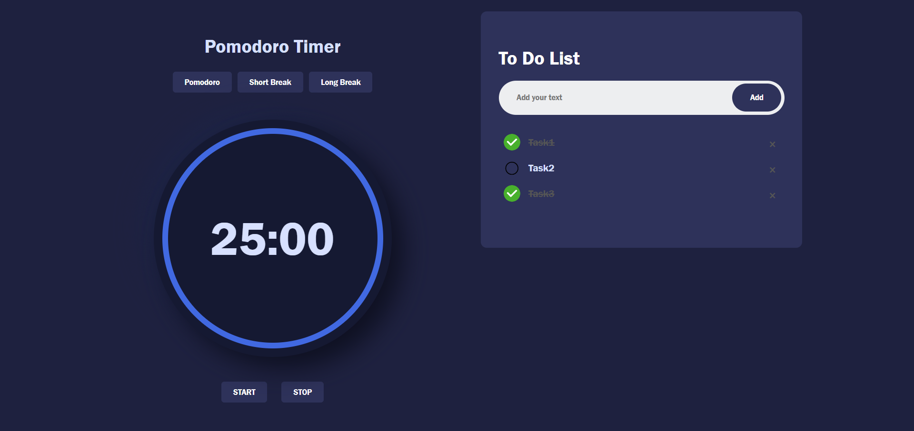

# Pomodoro Timer with ToDo List

## Introduction

This is a code repository for my Pomodoro Timer website which can be viewed [here](https://liyana-27.github.io/pomodoroTimer) or at <https://liyana-27.github.io/pomodoroTimer>.

I built this to better understand the basics of HTML, CSS and JavaScript. The Pomodoro method is a focus technique that allows users to work in chunks of 50 minutes followed by 10 breaks. After two or three such sessions, the user ideallyt takes a longer break of 30 minutes.

The website has the following features:

- A side-by-side view of the timer as well as his/her to-do list for the day
- Within the timer section, we have three options:
  - Pomodoro - 50 minutes of work time
  - Short Break - 10 minutes long
  - Long Break - 30 minutes long
- A 'Start' and 'Stop' button for the timer buttons. Once stopped, the timer resumes when started again.
- The right hand side section makes use of a simple to-do list to keep track of tasks.
- Tasks can be added, checked, unchecked and removed at the user's convenience.
- Tasks are not lost when the page is refreshed.

## Technologies

1. HTML
2. CSS
3. JavaScript
4. GitHub
